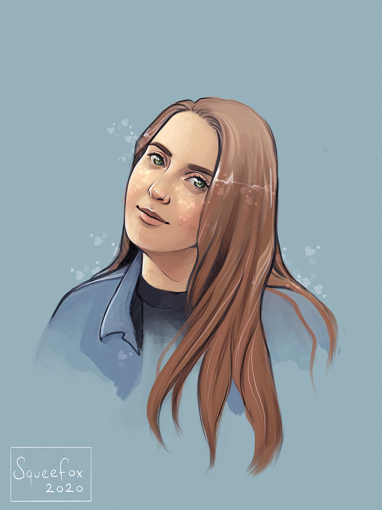

Hi, I'm Lia,
============

an aspiring developer
---------------------

Who?
----

I'm a graduate of Physics and Chemistry. I'm highly skilled in creative
problem-solving.

* * * * *

What?
-----

### Currently

I work full-time as a business analyst in a financial technology
company. I'm learning to code in my spare time, having had an interest
in it for many years.

### In the Future

I hope to progress my skills in multiple programming languages and work
as a full-stack developer. I want to create beautiful, highly
functioning web-pages to help people make the most out of an
increasingly online life.

* * * * *

Get In Touch
------------

### Have you got a great idea?

I'd love to hear it. You can contact me by e-mail or via any of the
following pages.

[Contact Me](mailto:lgrogan@tcd.ie)

[LinkedIn](https://www.linkedin.com/in/lia-grogan-a559a3150)
[Twitter](https://twitter.com/lia_grogan)
[Website](https://www.appbrewery.co/)

© 2020 Lia Grogan @ Seamount Web.
